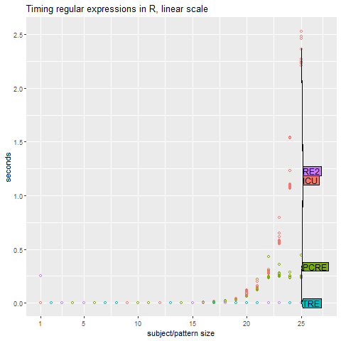
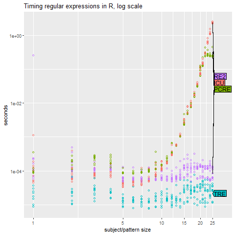

NOTE: This content assume that you do have a previous knowledge about the various functions used for Regular expression in R

Regular expressions simply help us extract some text patterns from large texts below is an example to extract some dates from a 5MB text file 
related to homicides in the united states you can find the text file from [Kaggle](https://www.kaggle.com/lenron1671/homicides). You can see a sample of the text structure below:

```
homicides <- readLines("homicides.txt")

homicides[1]

[1] "39.311024, -76.674227, iconHomicideShooting, 'p2', '<dl><dt>Leon Nelson</dt><dd class=\"address\">3400 Clifton Ave.<br />Baltimore, MD 21216</dd><dd>black male, 17 years old</dd><dd>Found on January 1, 2007</dd><dd>Victim died at Shock Trauma</dd><dd>Cause: shooting</dd></dl>'"

```
---
I can extract the data from this text using the following pattern: ```Pattern <- c("<dd>[F|f]ound(.*?)</dd>")```
and apply the same pattern using different  packages.


```
     ICU= stringi::stri_match(x, regex="<dd>[F|f]ound(.*?)</dd>")  # Stringi ----> ICU ( exp complexity for large evil large inputs)
     PCRE= regexpr("<dd>[F|f]ound(.*?)</dd>", x, perl=TRUE)        # regexpr where perl is set to TRUE ---> PCRE (exp complexity for large evil inputs)
     TRE=regexpr("<dd>[F|f]ound(.*?)</dd>", x, perl=FALSE)         # regexpr where perl is set to False ----> TRE ( polynomial complexity  )
     RE2=re2r::re2_match(x,"<dd>[F|f]ound(?P<Date>.*?)</dd>" )     # RE2r package -------> RE2 (polynomial complexity)

```
To further understand the various packages check this [link ](https://bookdown.org/rdpeng/rprogdatascience/regular-expressions.html)


Now We will compare the performance of the 4 functions to see which one is faste is extracting the date from the homocide txt file, note that 
this pattern is not evil( in terms of complexity it is relatively simple ). Let's benchmark it and see!

```{r, include = FALSE}
knitr::opts_chunk$set(
  collapse = TRUE,
  comment = "#>"
)

```

The timing figures for the following benchmark note:
```
homicides <- readLines("homicides.txt")
  max.N <- 25
  times.list <- list()
  for(N in 1:max.N){
    cat(sprintf("subject/pattern size %4d / %4d\n", N, max.N))
    x<-paste(homicides[1:N], collapse=" ")
    N.times <- microbenchmark::microbenchmark(
      ICU= stringi::stri_match(x, regex="<dd>[F|f]ound(.*?)</dd>"),
      PCRE= regexpr("<dd>[F|f]ound(.*?)</dd>", x, perl=TRUE),
      TRE=regexpr("<dd>[F|f]ound(.*?)</dd>", x, perl=FALSE),
      RE2=re2r::re2_match(x,"<dd>[F|f]ound(?P<Date>.*?)</dd>" ),
      times=10)

    times.list[[N]] <- data.frame(N, N.times)
  }
  times <- do.call(rbind, times.list)
  save(times, file="times.RData")

```
package microbenchmark gives us this wonderful summary:
```
N.times
Unit: microseconds
 expr   min    lq   mean median    uq   max neval
  ICU  41.2  45.3  56.11  52.25  58.9  96.2    10
 PCRE  89.0  90.7  94.91  93.10  96.8 113.3    10
  TRE  21.8  24.3  29.20  29.95  31.7  39.2    10
  RE2 118.4 130.6 149.33 138.60 153.0 241.1    10

```
noting that the numbers are in micro seconds so in linear time we can assume that the 4 methods consumed 0 seconds, but how will the results change 
when the no of possible comparisions greatly increse ( EVIL regular expression)???

---


```{r include=FALSE}
knitr::opts_chunk$set(
  collapse = TRUE,
  comment = "#>"
)
evilRegex::evilRegex()
```
Now lets try our the function evilRegex() ```pattern <- "^(a+)+$" ```
```subject<-paste(rep(c("a","X"), c(N,1)), collapse="") ```  where subject = ax (N=1) , =aax(N=2), = aaax(N=3) and so on


```
evilRegex::evilRegex()

```
Timings from micro benchmark:
```
N.times
Unit: microseconds
 expr       min        lq       mean     median        uq       max neval
  ICU 2134799.1 2147828.3 2193954.75 2174281.80 2191353.4 2384468.1    10
 PCRE  222484.6  225298.7  234283.99  232554.05  240938.2  249156.0    10
  TRE      11.4      28.4      32.25      31.65      38.8      46.7    10
  RE2      58.6      67.4     104.57     111.95     127.8     148.0    10
```
Can you spot the big differnece between TRE,RE2 and ICU,PCRE
this will become more clear with the following graphs:


  





```{r setup}
library(evilRegex)
```

